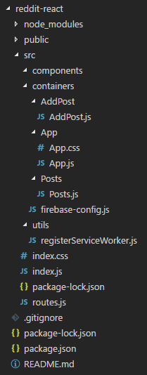

  

## [Aprender javascript con MentoringJS.](http://mentoringjs.com)  

### React y firebase ejemplo práctico  


Hola chic@s!! Os traigo un articulo sobre una pequeña app que combina React.js, react router y firebase. Una combinación perfecta para nuestras app.  

Puedes encontrar el resultado de este articulo subido en [surge](http://jgomper-reddit.surge.sh/) o en mi [repositorio de GitHub](https://github.com/jordigomper/react-react-route-firebase).

### ¿Que es Firebase?
Firebase ofrece un conjunto de herramientas que hacen más fácil el desarrollo de nuestras apps.  
Ofrece servicios como base de datos a tiempo real, autentificar con gmail, facegook, registro con email... Un almacenamiento para las apps que necesitan guardar archivos del usuario incluso un servicio hosting entre un gran etc etc...  

### ¿Que es react-router?
Es una librería que permite gestionar las rutas de una aplicación que utilice React.  
  
### Primer paso.

Empezamos abriendo la consola y creando la estructura para trabajar en local gracias al paquete [create-react-app](https://jordigomper.github.io/myblog/react.js/2017/08/04/React-analizando-su-estructura.html#instalaci%C3%B3n). Entramos dentro del nuevo directorio y ejecutamos nuestra app con **npm start**.  

Para nuestra aplicación vamos a seguir la estructura que ya he mencionado en un [articulo anterior](https://jordigomper.github.io/myblog/articulo/2017/09/30/Empieza-tu-proyecto-con-React.html) en el apartado de **Estructurando un proyecto**. Básicamente dentro de la carpeta src vamos a crear una carpeta llamada components para nuestros componentes simples y otra llamada container con los componentes con la lógica de la aplicación. Tiene que tener la siguiente estructura:  
  
  

Ahora vamos a seguir los siguientes pasos para instalar react-router y firebase.

### Instalando react-router.

Ahora vamos a instalar la librería que nos va a permitir crear las rutas para nuestros diferentes apartados. Desde la consola cmd utilizando el controlador de paquetes [npm](https://github.com/jordigomper/recursos/blob/master/node.md) vamos a ir al directorio principal de nuestra app y vamos a introducir el siguiente comando: **npm install --save react-router-dom**. Ahora ya tenemos instalado react-router en su ultima versión (v4).  

### Instalando firebase.

Para instalar firebase seguimos los mismos pasos, desde el directorio principal instalamos firebase introduciendo el siguiente comando: **npm install --save firebase**. Firebase ya esta casi listo y esperando ordenes, solo nos falta registrarnos en su web para tener esas suculentas ventajas que nos ofrece.  

Vamos a la [web de firebase](https://firebase.google.com/) y nos creamos una cuenta. Una vez registrado, en la parte superior derecha presiona la opción **IR A LA CONSOLA**. Una vez dentro pulsa añadir proyecto y crea un proyecto. Bienvenido a tu panel de control donde vas a poder gestionar tu base de datos a tiempo real.  

Lo primero que vas a hacer es ir a la pestaña del menú de la izquierda Database y vas a crear una. Una vez creada, vete a la pestaña que esta en la parte superior de la pantalla principal **REGLAS** y tienes que substituir las exclamaciones de **read y write** por igualación:  

  

Esto permite leer y escribir en la base de datos sin necesidad de estar logeado en la aplicación. Ahora ya lo tienes todo listo para empezar a utilizarla.

### Componentes y estructura.

En este apartado voy a enseñarte los diferentes componentes y como funciona **react-router y firebase**.  
  
### firebase-config.js
```
// Initialize Firebase
import * as firebase from "firebase";

var config = {
  apiKey: "#########################",
  authDomain: "reddit-aa152.firebaseapp.com",
  databaseURL: "https://reddit-aa152.firebaseio.com",
  projectId: "reddit-aa152",
  storageBucket: "reddit-aa152.appspot.com",
  messagingSenderId: "256368460841"
};

firebase.initializeApp(config);

export default firebase;
```
  
Antes de empezar lo primero es crear el este objeto que contiene toda la configuración para que nuestra app pueda comunicarse con firebase.  
  
Copia este componente tal cual, después, vete a la consola de la web de firebase, haz click en **Project Overview** arriba a la izquierda, selecciona **Añade Firebase a tu aplicación** en la pantalla principal y copia el objeto config y pegalo substituyendo el de este componente.  
  
Con esto ya tienes la conexión a firebase.
  
### index.js
```
import React from 'react';
import ReactDOM from 'react-dom';
import { BrowserRouter } from 'react-router-dom';

import Routes from './routes';
import registerServiceWorker from './utils/registerServiceWorker';

import './index.css';

ReactDOM.render(
    <BrowserRouter>
        <Routes />   
    </BrowserRouter>, 
    document.getElementById('root')
);
registerServiceWorker();
```

Este es el index de la aplicación, voy a comentarlo de arriba a abajo. Primero importamos los diferentes módulos que vamos a utilizar y entre ellos encontramos **BrowserRouter** que ahora voy a hablar sobre él y los diferentes componentes y css.  
Dentro de la función ReactDOM.render se encuentra el componente BrowserRouter que esta importado desde el módulo de react-router-dom. Siempre desde el comienzo de una aplicación que utilice react-router se tiene que determinar que enrutador usar. Para aplicaciones dinamicas hay que utilizar **BrowserRouter** envolviendo el componente principal.  
En este caso vamos a suponer que nuestra aplicación va a estar en un servidor dinámico, envolviendo el componente Routes que es el que se encarga de mostrar las diferentes rutas.  
 
#### routes.js

```
import React from 'react';
import { Switch, Route } from 'react-router-dom';

import App from './containers/App/App';
import AddPost from './containers/AddPost/AddPost';

const Routes = () => (
  <div>
    <Switch>
      <Route path="/addpost" component={ AddPost } />
      <Route path="/" component={ App } />
    </Switch>
  </div>
);

export default Routes;
```
Este componente se encarga de gestionar las diferentes rutas y las muestra por pantalla. Es un componente simple y no lo esta alojado en la carpeta components ya que realmente no funciona como un componente que muestre información o estilo, así que mejor dejarlo en el directorio principal.  
  
La etiqueta **&lt;Switch&gt;** sirve para agrupar las diferentes rutas. Iterará por ellas y solo representará la primera que coincida con el nombre actual de la ruta.  
  
En este caso hay dos rutas compuestas por el componente **&lt;Route&gt;**. Funciona como enrutador y con él creamos las diferentes rutas. Con el atributo **path** indicamos en que ruta debe mostrar el componente indicado en **component**. En este caso he colocado **addpost** como primera ruta por que de la otra manera siempre mostraría el componente **App** que esta indicado como principal **"/"** ya que coincide con todas.  
  
### App.js
```
import React, { Component } from 'react';

import Posts from '../Posts/Posts';
import firebase from '../firebase-config';

import './App.css';

class App extends Component {

  state = {
    posts: "",
  }

  componentWillMount() {
    let postsRef = firebase.database().ref('posts');
  
    postsRef.on('value', snapshot => {
      this.setState({
        posts: snapshot.val(),
      });
    });
  }
 
  render() {
    let posts = this.state.posts
    if(posts) {
      return (
        <div className="App">
          { Object.keys(posts).map(function(key) { return <Posts key={key} post={posts[key]} id={key}/> })}
        </div>
      )
    }
    
    return (
      <div className="App">
        Loading...
      </div>
    );
  }
}

export default App;
```

Este componente se encarga de conectar con firebase y mostrar los datos alojados, en este caso simula un muro donde puedes dar a me gusta o no me gusta a una publicación.  
  
Empezando de arriba a bajo primero hago es llamar al componente firebase-config que contiene toda la lógica para conectarse a firebase.  
  
El estado del componente contiene la variable **posts** que se encargara de recoger los datos recibidos de firebase.  

El lifecycle **componentWillMount()** contiene la conexión a firebase:

```
componentWillMount() {
    let postsRef = firebase.database().ref('posts');
  
    postsRef.on('value', snapshot => {
      this.setState({
        posts: snapshot.val(),
      });
    });
  }
```
Primero creo una conexión llamando a **firebase.database().ref('posts')**. Firebase utiliza una estructura muy parecida a JSON, así que todos los posts se van a almacenar dentro del "objeto" posts, por eso indicamos en **.ref()** que nos devuelva el objeto que contiene todos los posts.  
  
La función **postsRef.on('value', snapshot => {})** devuelve la información solicitada y la almacena en el atributo del estado posts.  
  
Dentro del **render()** del componente primero comprueba si existe el estado posts, ya que como React va como una moto a firebase no le da tiempo a devolver la información y esto crashea la aplicación. Si ya tenemos los posts con la función **Object.keys(posts).map()** recorremos las diferentes "keys" que componen el objeto posts y que son los diferentes post y llamamos al componente **Post** por cada una, pasándole la información. Si todavía no tiene los posts, muestra un mensaje **"Loading..."**.  
  
#### Post.js
```
import React, { Component } from 'react';
import firebase from '../firebase-config';

class Posts extends Component {

  state = {
    id: this.props.id,
    post: this.props.post,
  }

  componentWillReceiveProps({post}) {
    if(post !== this.state.post )
      this.setState({post})
  }

  handleUpvote = () => {
    firebase.database().ref('posts/' + this.state.id).set({
      ...this.state.post,
      upvote: this.state.post.upvote + 1
    });
  }
  
  handleDownvote = (item) => {
    firebase.database().ref('posts/' + this.state.id).set({
      ...this.state.post,
      downvote: this.state.post.downvote + 1
    });
  }

  render() {
    const post = this.props.post;
    
    return(
      <div className="Posts">
        <div>
        <div>Title: { post.title }</div>
        <div>Upvotes: { post.upvote }</div>
        <div>Downvotes: { post.downvote }</div>
        <div>
          <button
            onClick={ this.handleUpvote }
            type="button"
          >
            Upvote
          </button>
          <button
            onClick={ this.handleDownvote }
            type="button"
          >
            Downvote
          </button>
        </div>
        </div>
      </div>
    )
  }
}

export default Posts;
```
Primero vamos a importar el componente **firebase-config** ya que lo vamos a necesitar para actualizar el ranking de votos.  
  
El estado contiene los atributos **id** que contiene la key del post y **post** que contiene el contenido.

Lyfecycle **componentWillReceiveProps()** para actualizar los componentes que se han modificado.  
  
Las funciones **handleUpvote()** y **handleDownvote()** se encargan de sumar los dos tipos de votos:  

```
firebase.database().ref('posts/' + this.state.id).set({
    ...this.state.post,
    upvote: this.state.post.upvote + 1
});
```  
  
Conecta a firebase solicitando la key de nuestro post que se encuentra dentro de posts. Después con **.set()** agregamos todo el contenido original y sumamos un upvote o downvote. Es importante agregar todo el contenido original si no lo modifica por undefined.  
  
Dentro del **render()** se muestra toda la información y se añaden dos botones para los votos.  
  
#### AddPost
```
import React, { Component } from 'react';
import firebase from "../firebase-config";

class AddPost extends Component {
  
  state = {
    title: ''
  }

  handleChange = (e) => {
    this.setState({
      title: e.target.value
    })
  }

  handleSubmit = (e) => {
    e.preventDefault();
    let firebaseRef = firebase.database().ref('posts');
    firebaseRef.push({
      title: this.state.title,
      upvote: 0,
      downvote: 0
    })

    this.setState({
      title: ''
    });
  }

  render() {
    return (
      <div className="AddPost">
        <input
          type="text"
          placeholder="Write the title of your post"
          onChange={ this.handleChange }
          value={ this.state.title }
        />
        <button
          type="submit"
          onClick={ this.handleSubmit }
        >
          Submit
        </button>
      </div>
    );
  }
}

export default AddPost;
```  
  
Desde aquí podemos añadir posts a nuestro muro. El componente va guardando todos el texto que se introduce en el input y pulsando el botón Submit los envia desde la función **handleSubmit()** utilizando **firebaseRef.push({})**. En el interior se encuentra toda la información del nuevo post que se envía a firebase.

#### Conclusión
La base de datos a tiempo real de firebase hace un gran complemento con nuestras aplicaciones creadas con React. React-router ofrece de una forma fácil nuestras rutas a las diferentes "páginas".  

Hoy has visto una aplicación sencilla, la función de este articulo es comprender como funciona react, react-router y firebase y como puedes combinarlos. Practicando un poco todo lo que has aprendido en este articulo puedes hacer cosas muy chulas.  

Para este articulo he consultado las siguientes fuentes:  
* [Un manual de 10 sobre react-router](https://medium.com/@pshrmn/a-simple-react-router-v4-tutorial-7f23ff27adf)  
* [Este articulo puede acabar de resolver tus dudas con firebase](https://css-tricks.com/intro-firebase-react/)  
* [Inspiración para crear esta app](https://www.google.com/url?hl=ca&q=https://www.sitepoint.com/reddit-clone-react-firebase/&source=gmail&ust=1516043684340000&usg=AFQjCNHXAXtIYMONfKdzUSph3fDugYdmSA)
  
Un saludo, hasta pronto!!  

**A tope con @mentoringJS!  
Jordi Gomper.**